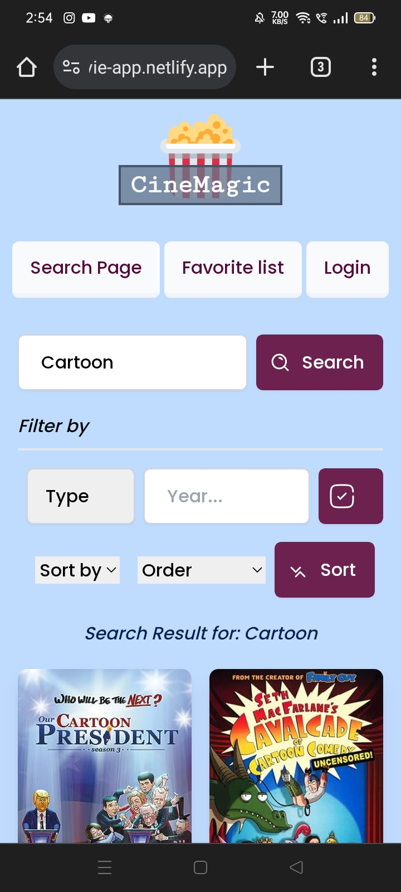
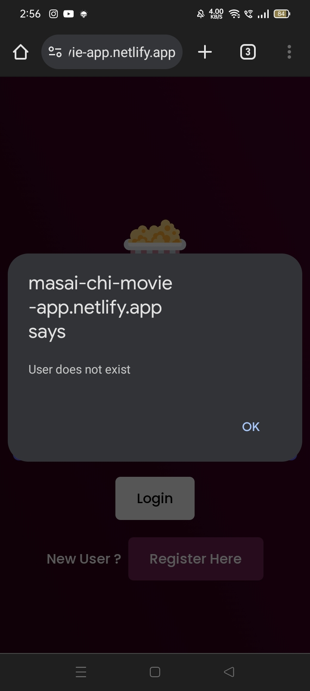

# React-Movie-Suggestion-App
This repository contains the code for a frontend-only Movie Suggestion App developed using React. The app interfaces with the Open Movie Database (OMDB) API to fetch movie data.

## Assignment: React Movie Suggestion App

### Overview:

Develop a frontend-only Movie Suggestion App using React, interfacing with the OMDB API. The app should enable users to search for movies, view details, and save their favorites to local storage, with options for sorting and filtering.
### Objectives:
- Interface with the OMDB API to fetch movie data.
- Implement frontend features like searching, sorting, filtering, and saving favorites using local storage.
- Create a user-friendly interface using React.

### Requirements:

1.  Setup and Configuration:
     - Initialize a new React project.
     - Set up OMDB API integration.

2.  Signup and Login Feature
     - Use local storage for this.
     
     
     


3.  Search Functionality:
     - Implement a search bar to allow users to search for movies by title.
     - Display search results in a responsive layout.
     


4.  Sorting Features:
     - Allow users to sort search results by different criteria (e.g., year, rating).
     


5. Filtering Options:
     - Implement filters to narrow down search results (e.g., genre, release year).
     


6. Movie Details:
     - On selecting a movie, display detailed information about the movie in a new view.
     

7. Favorites Page and Local Storage:
    - Allow users to save movies to a 'Favorites' list using local storage.
    - Create a 'Favorites' page where users can view and manage their saved movies.
     

8. Styling:
    -  Use CSS/SCSS for styling.
    - Ensure the app is responsive and visually appealing.

     <!--  -->

9. Error Handling:
    - Implement error handling for API requests.
    - Display user-friendly error messages.
     <!-- {width=40px height=40px} -->


10. Documentation:
    - Comment your code adequately.
    - Include a README file explaining how to set up and run your project.
### Bonus Features (Optional):
- Implement pagination or infinite scrolling for search results.
- Incorporate animations or transitions for a better user experience.

 

## Getting Started
Install dependencies: `npm install` Run the development server: `npm run dev` Available Scripts
```
npm run dev
```
Runs the development server.

```
npm run build
```
Builds the app for production. The build artifacts will be located in the dist/ directory.

[Github](https://github.com/shabbiryahya/React-Movie-Suggestion-App)
&nbsp;
[Deployed](https://masai-chi-movie-app.netlify.app/)&nbsp;
[Contact](tel:+919574713452) &nbsp;
[Instagram](https://www.instagram.com/ifsebyy)


